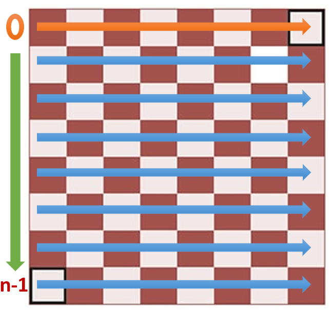
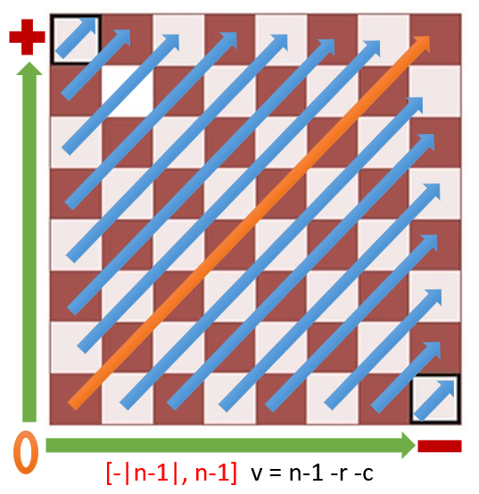
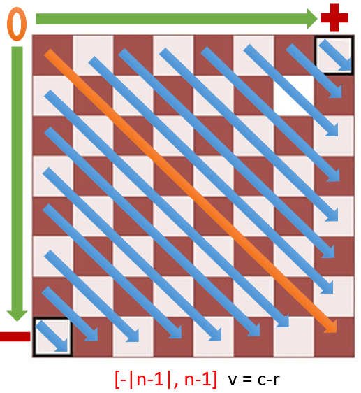

# JavaScript

## Solution Explanation 
For this solution we found very important the use of HashSet objets to reduce the complexity and simplify the validation of rows and diagonals. 
> This is posible due to the `HashSet.has()` method which it's complexity is O(1).

|  Variable Name  | Description | Type |      Size      | Visual Explanation |
|     :---:       |    :----:   | :--: |     :---:     | :-: |
|       boardSize         | Input Number  | Integer |     |  |
|      availableRows       | Numbers of the rows available | Array |    `n`   |  |
|       queens         | Stores the row of each queen  | HashSet |       `n`      |  |
|      positiveDiagonal       | Stores the number of Positive Diagonal which is no more longer available        | HashSet |    `(n*2)-1`   |  |
|      negativeDiagonal       | Stores the number of Negative Diagonal which is no more longer available | HashSet |    `(n*2)-1`   |  |


---
## Installation
To install this repository correctly follow the next steps.

1. First of all, in the terminal put the next code to clone this repository:

    ```sh
        git clone https://github.com/Rafael-Anguiano/N-Queens.git
        cd N-Queens/JavaScript
    ```

2. The next step is to make sure you have a way to run this code, in this situation we will use [Node.js](https://nodejs.org/en/download/), if you don't have it installed, we recommend you to download it.


3. Once you have installed a runner, you are ready to start simulating and editing some code. To run this app use the next command in the terminal (Be sure you are in the correct directory).

    ```sh
        node index.js <boardSize1> <boardSize2> <boarSize...>
    ```

    or
    ```sh
        node allInOne.js <boardSize1> <boardSize2> <boarSize...>
    ```

---

## Testing
To start testing this repository
1. Run the next `npm` command to install the dependencies.
    ```sh
        npm install
    ```

2. Run the test files.
    ```sh
        npm test
    ```