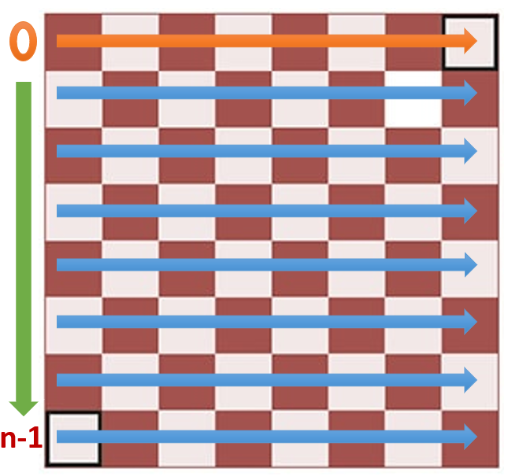
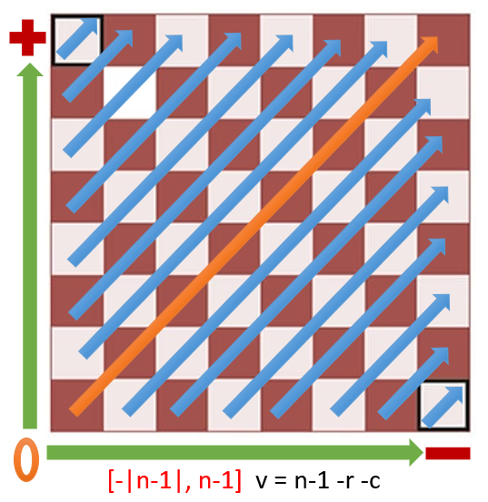
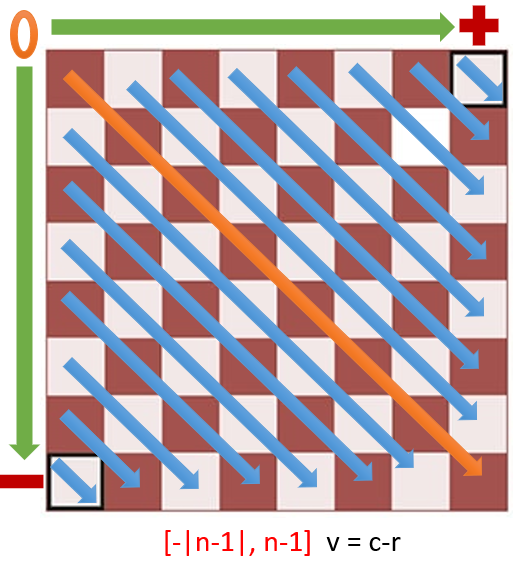

# N-Queens

## Problem:
> * Place  N queens on said  N×N   chessboard so that **no two queens threaten each other**. 
> * The ***Queen*** can move in it's line or row, or diagonally, any number of squares


## Description
This is my solution for this problem/puzzle.
> This algorithm shows only one solution by time runned.
 - Made using Javascript.

## Solution Explanation 
For this solution we found very important the use of HashSet objets to reduce the complexity and simplify the validation of rows and diagonals. 
> This is posible due to the `HashSet.has()` method which it's complexity is O(1).

|  Variable Name  | Description | Type |      Size      | Visual Explanation |
|     :---:       |    :----:   | :--: |     :---:     | :-: |
|       n         | Input Number  | Integer |     |  |
|      Disp       | Numbers of the rows available | Array |    `n`   |  |
|       q         | Stores the row of each queen  | HashSet |       `n`      |  |
|      Dpos       | Stores the number of Positive Diagonal which is no more longer available        | HashSet |    `(n*2)-1`   |  |
|      Dneg       | Stores the number of Negative Diagonal which is no more longer available | HashSet |    `(n*2)-1`   |  |


---
## Installation
To install this repository correctly follow the next steps.

1. First of all, in the terminal put the next code to clone this repository:

```sh
    git clone https://github.com/Rafael-Anguiano/N-Queens.git
    cd N-Queens/
```

2. The next step is to make sure you have a way to run this code, in this situation we will use [Node.js](https://nodejs.org/en/download/), if you don't have it installed, we recommend you to download it.


3. Once you have installed a runner, you are ready to start simulating and editing some code. To run this app use the next command in the terminal (Be sure you are in the correct directory).

```sh
    node N-Queens.js
```
--- 
## Notes:
 - There are many different ways to solve this puzzle with the same input.
 - The algorithm have a random percentage, this means you could receive a different solution each time.
 - The Queen can move in its line or row, or diagonally, any number of squares.

---
## ScreenShots of the Results


---
## Developed By:
    Rafael de Jesús Anguiano Suárez del Real (April 2022)

